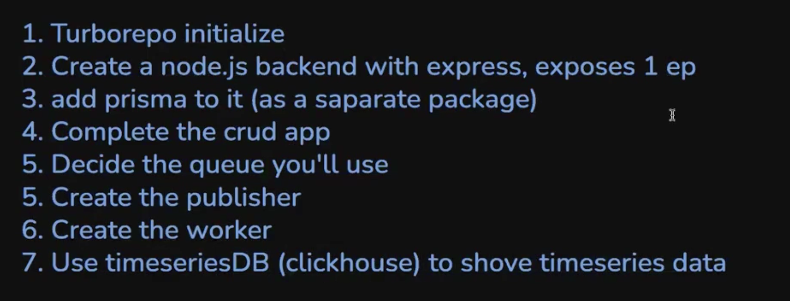

```bash
docker run -p 5432:5432 -d -e POSTGRES_DB=postgres -e POSTGRES_PASSWORD=postgres --name=postgres-local postgres 
```

### [Remaining topics](https://common-bar-39a.notion.site/Cohort-3-Offline-Videos-190ce778f821809fb813f86362cf13c3)